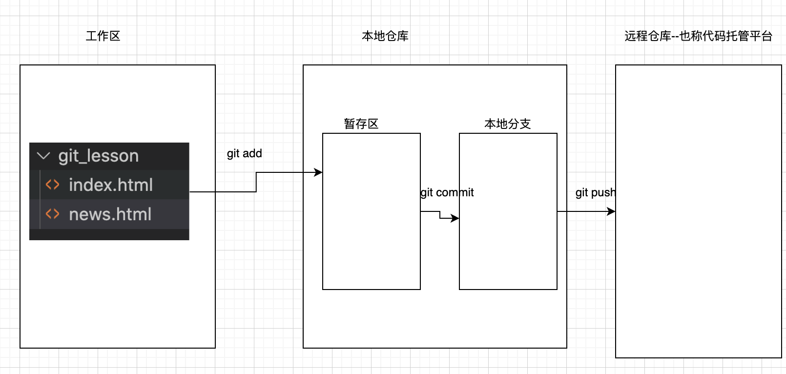
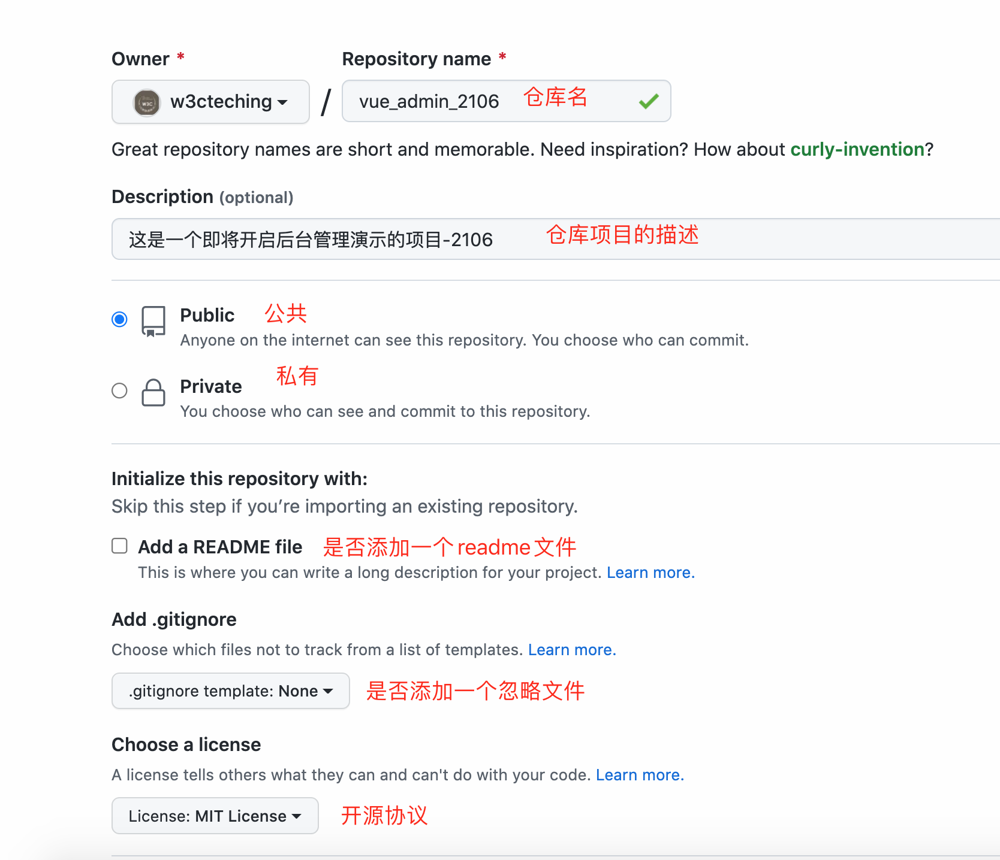
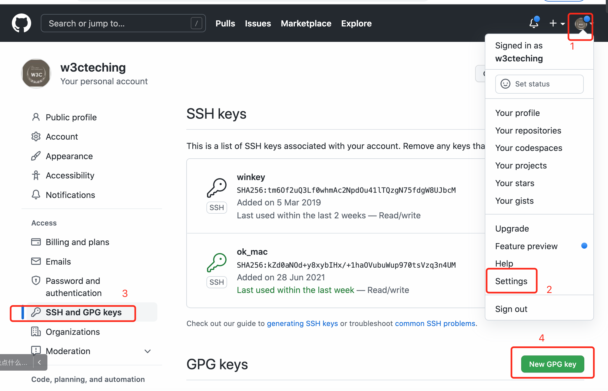

## 一、git是什么

git是一款分布式的版本控制工具

分布式：不依赖于某个中心服务器，每个终端都可以独立工作

集中式：必须依赖一个中心服务器，如果没有中心服务器，每个终端是不能工作

版本：git中一个版本就是一次修改,所以git管理的是修改，而不是文件

版本管理技术：git,svn

git：分布式管理

svn:集中式管理

## 二、git使用

### 2.1 下载安装git软件

```
1.下载软件  git for windows   
gitforwindows.org/

2.sourcetree
```


### 2.2 git命令行方式使用

 ```
1.初始化git，方便跟踪项目文件:   git init

生成一个.git 目录，这是一个隐藏目录

2.查看git状态：git status

3.添加到暂存区：git add  要添加的文件名

   git add index.html

4.提交到本地仓库(本地分支): git commit -m '本次操作的描述'

  例如：git commit -m '创建一个index.html文件'
  
5. 查看提交日志

    git log
    或
    git log --pretty=oneline
    
    或
    git reflog
 ```

> 如何电脑中第一次使用git命令，可能让你设置本地用户名，本地邮箱，告诉git，你是谁？
>
> ```
> 设置：
> 	git config --global user.name '名子'
> 	git config --global user.email 'xxx@126.com'
> 
> 查看：
>  git config --list
> ```
>
> 


### 2.3 工作区、暂存区和本地分支的关系




### 2.4 如何将本地分支代码提交到远程仓库

步骤：

- 第一步：找一个线上代码托管空间

    - github
    - gitlab
    - 码云
    - 。。。。

    

- 开通一条隧道

    - 创建一个公钥和密钥对来完成安全隧道的开通

    - 生成公钥和密钥的命令：

        ```
        ssh-keygen -t rsa -b 4096 -C "邮箱名@example.com"
        
        会出成两个文件
        id_rsa
        id_rsa.pub  将此文件放入远程github ssh中，见下图：
        ```

        

        

- 连接远程仓库

    ```
    验证能否连接成功：
    ssh -T git@github.com
    
    返回：Hi w3cteching! You've successfully authenticated, 
    
    再连接远程仓库：
    
    git remote add   origin       git@github.com:w3cteching/vue_admin_2106.git
    git remote 添加  远程仓库名称   远程仓库地址
    
    
    查看git remote -v 
    [推荐]git@github.com:w3cteching/vue_admin_2106.git
    https://github.com/w3cteching/vue_admin_2106.git
    ```

    

- 将本地代码推送到远程仓库

    - 如果远程有本地没有的文件，则要先将远程的文件先拉取到本地，然后再推送到远程
    - 拉取：git pull origin master
    - 推送：git push origin master  -u

    

