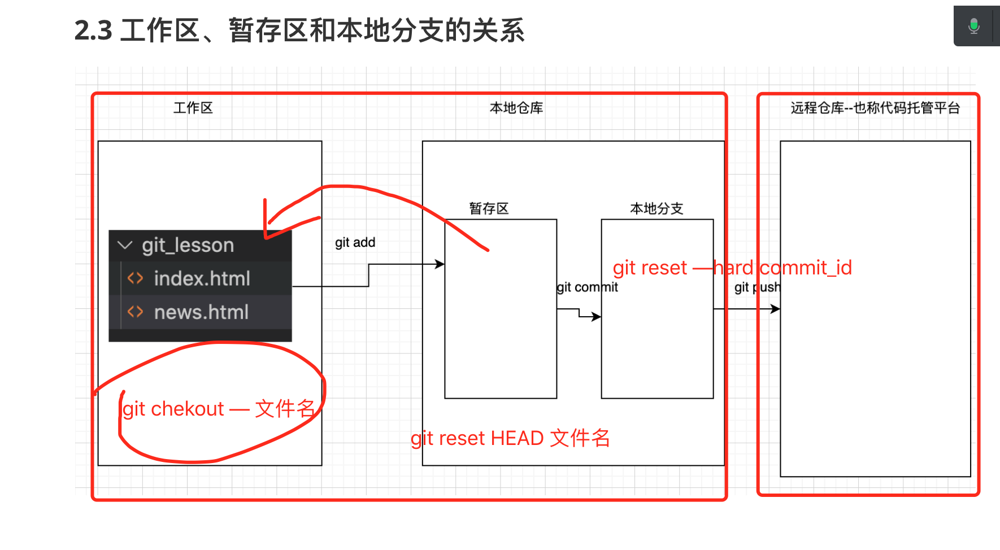
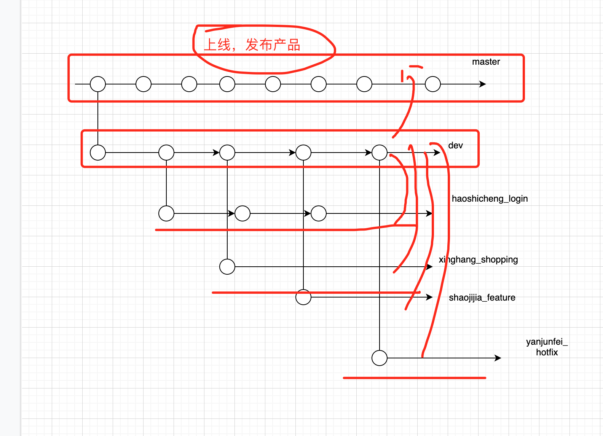
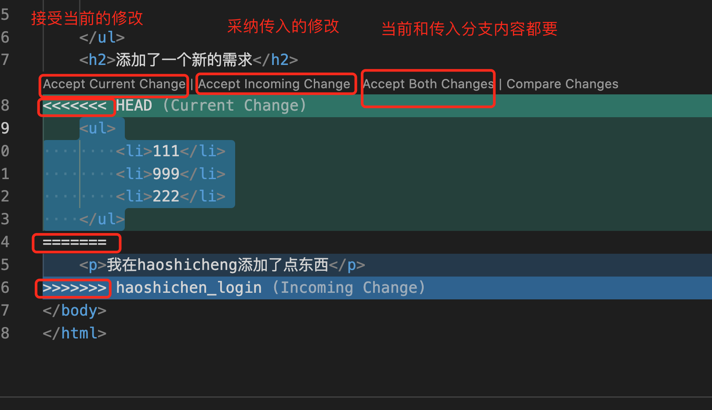

## 一、复习一下昨天内容

```
git是什么：开源，分布式的代码版本管理工具
常用命令：

git init 
git add 文件名 或 .
git commit -m '本次操作的描述或说明'

查看本地日志：
git log
git reflog

连接远程步骤：
创建远程仓库
创建公钥和密钥 ssh-keygen -t rsa -b 4096 -C '邮箱'  .ssh/id_rsa  id_rsa.pub
连接远程仓库：
    git remote add origin  远程仓库地址
查看连接远程仓库信息
    git remote -v
    
删除本地连接信息

  git remote rm 远程仓库名
 
```


## 二、今天目标

### 2.1 历史回退

```
1.已经提交到本地分支：

   格式：
   git reset --hard commit_id
   
   例如：git reset --hard 6cdffd201
   
2.直接从工作区放弃

	git checkout -- 文件名

3.已经从工作到添加到暂存区，如何撤消

   第一步：先从暂存区回到工作区
   
     git reset HEAD 要放弃修改的文件名
     
   第二步：然后再直接放弃对工作区的修改
   
    git checkout 要放弃修改的文件名
 
 

```



### 2.2 分支管理[重点]

分支是git管理项目代码，防止不同人开发时冲突的方案




分支常用命令：

```
查看分支：git branch    

   例如：* master 星号代码是当前分支  
   
  默认一个仓库中有一个master分支
   
创建分支：git branch 新分支名

切换分支：git checkout 要切换的分支名

创建并切换：git checckout -b 新分支名
合并分支：git merge 要合并的分支名
删除分支: 
     git branch -d 要删除的分支名   //删除已合并的分支
     git branch -D 要删除的分支名   //删除未合并的分支

git push 远程名  要推送分支名
git push 远程名  :要删除分支名
```


### 2.3 多人操作同一个文件，出现冲突如何解决？？？



解决思路：

- 多人修改同一个文件时，出现冲突
- 通过git和编辑器提示，手动修改解决冲突(采用当前，采用要合并的，还是两者都要)
- 再git add ,git commit 
- 最后git push远程

### 2.4 tag管理

tag主要用于发布上线版本

```
git tag
git tag 版本号
git tag 版本号  commit_id
git tag -d 要删除的版本号


git push 远程名  要推送tag版本号
git push 远程名  :要删除tag版本号
```


### 2.4 如何进行多人协作开发